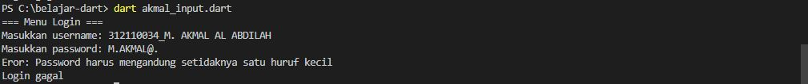

# Pemograman_Mobile2-Latihan_Dart_2
## Latihan Menggunakan Bahasa Dart


<p align="center">
 
</p>
<p align="center">
<a href="https://github.com/akmalabdilah"></a>
<p align="center">

<p align="center">
<a href="https://github.com/akmalabdilah/Tutorial_Drat_2.git">Requirements</a> •
<a href="https://github.com/akmalabdilah/Tutorial_Drat_2.git">Informasi</a> •
<a href="https://github.com/akmalabdilah/Tutorial_Drat_2.git">Tutorial</a>
</p>
</div>

# Requirements
- [Dart](https://git-scm.com/download)

# Informasi Dart
Apa itu Dart?
<p>
Dart adalah bahasa pemrograman yang dikembangkan oleh Google. Dart didesain untuk membangun aplikasi lintas platform, termasuk aplikasi mobile untuk Android dan iOS, aplikasi web, dan juga aplikasi desktop. Dart memiliki sintaks yang mirip dengan bahasa pemrograman C dan JavaScript, sehingga relatif mudah dipelajari bagi para pengembang yang sudah memiliki pengalaman dengan bahasa-bahasa tersebut. Salah satu keunggulan Dart adalah fitur Just-in-Time (JIT) dan Ahead-of-Time (AOT) compilation yang memungkinkan aplikasi yang ditulis dengan Dart berjalan dengan performa tinggi. Dart juga dilengkapi dengan kerangka kerja Flutter yang populer untuk pengembangan aplikasi mobile dan UI yang kaya.
</p>

# Tutorial
- Pada saat pertama kali menggunakan Dart, perlu dilakukan penginstalan extension
di visual Studio Code. Jalankan perintah berikut:

```bash
> Dart
```


- Setelah itu jalankan perintah Ctrl+Shift+P dan tulis Dart: New Project. untuk membuat repository 

- Untuk membuat file pilih yang bagian ke dua dan berilah nama sesuka kalian dan jika sudah di pindahkan ke halaman folder hapus isi yang ada di polder dan buat file baru di dalam polder tersebut.

### ini adalah koding dart serta hasil runnya yang berhasil dan gambaran run apa bila tidak mengikuti validasi yang berlaku pada kode dart.

<h1> Soal buatkan codingan fungsi validasi login dalam bahasa dart, dengan kualifikasi berikut:</h1>

- untuk user name
  - min 6 karakter.
- Untuk password 
  - min 6 karakter.
  - harus ada huruf besar.
  - harus ada character.
  - harus ada angka.
  - harus ada huruf kecil.


Diatas ini adalah gambar koding run yang di bawah apa bilah tidak ada yang eror pas input data user name dan password

```dart
import 'dart:io';

void main() {
  // Memanggil fungsi login
  bool isLoggedIn = login();

  if (isLoggedIn) {
    print("Login berhasil");
  } else {
    print("Login gagal");
  }
}

bool login() {
  print("=== Menu Login ===");

  stdout.write("Masukkan username: ");
  String username = stdin.readLineSync()!;

  stdout.write("Masukkan password: ");
  String password = stdin.readLineSync()!;

  // Memeriksa panjang password
  if (password.length < 6) {
    print("Eror: Password harus memiliki setidaknya 6 karakter");
    return false;
  }

  // Memeriksa keberadaan huruf besar
  if (!password.contains(RegExp(r'[A-Z]'))) {
    print("Eror: Password harus mengandung setidaknya satu huruf besar");
    return false;
  }

  // Memeriksa keberadaan huruf kecil
  if (!password.contains(RegExp(r'[a-z]'))) {
    print("Eror: Password harus mengandung setidaknya satu huruf kecil");
    return false;
  }

  // Memeriksa keberadaan angka atau karakter khusus
  if (!password.contains(RegExp(r'[0-9\W]'))) {
    print(
        "Eror: Password harus mengandung setidaknya satu angka atau karakter khusus");
    return false;
  }

  // Jika semua persyaratan terpenuhi, login berhasil
  return true;
}

```

- Dibawah adalah Gambar run yang eror apa bilah pas input data password tidak mengikuti aturan validasi yang dibuat Eror: Password harus memiliki setidaknya 6 karakter


- Dibawah adalah Gambar run yang eror apa bilah pas input data password tidak mengikuti aturan validasi yang dibuat Eror: Password harus mengandung setidaknya satu huruf besar


- Dibawah adalah Gambar run yang eror apa bilah pas input data password tidak mengikuti aturan validasi yang dibuat Eror: Password harus mengandung setidaknya satu huruf kecil



- Dibawah adalah Gambar run yang eror apa bilah pas input data password tidak mengikuti aturan validasi yang dibuat Eror: Password harus mengandung setidaknya satu angka atau karakter khusus


- Untuk kode dartnya sama sama yang di atas karna 4 gambar eror barusan hanya untuk gambaran saja apa bila eror memasukan password karna tidak mengikuti validasi yang berlaku, Sekian dan.


- Selesai


<div>
<h2 align="center">Thanks For Reading!!!</h2>
<div align="center">
